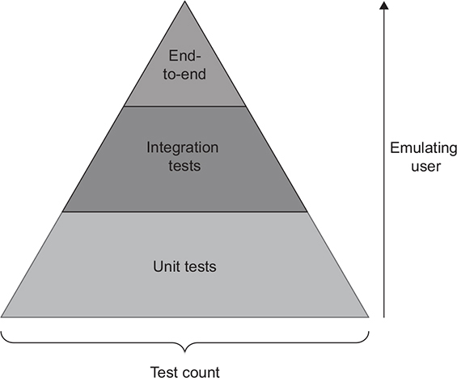
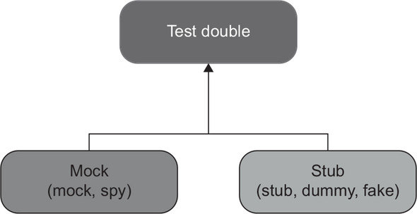
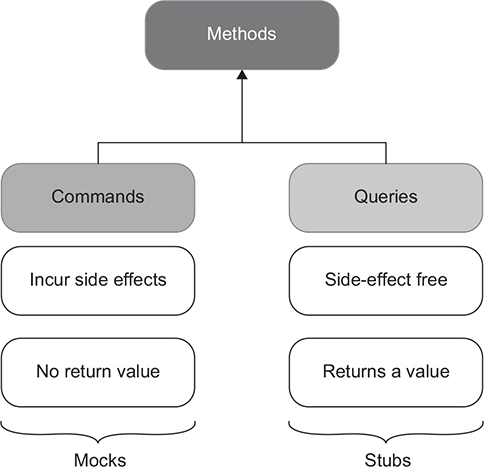

### Metrics to measure good test:

- Protection againts regression
- Resistance to refactoring
- Speed (fast feedback)

The trade-off between the first three attributes of a good unit test is similar to the CAP theorem: there is the two-out-of-three trade-off.

### Test Pyramid


The Test Pyramid advocates for a certain ratio of unit, integration, and end-to-end tests.

End-to-end tests favor protection against regressions, while unit tests favor fast feedback

The exact mix between types of tests will be different for each team and project. But in general, it should retain the pyramid shape: end-to-end tests should be the minority; unit tests, the majority; and integration tests somewhere in the middle.


### Black-box vs White-box testing

- Black-box testing is a method of software testing that examines the functionality of a system without knowing its internal structure
- White-box testing is the opposite of that. It’s a method of testing that verifies the application’s inner workings

### Mocks vs Stubs



- **Mocks** help to emulate and examine outcoming interactions. These interactions are calls the SUT makes to its dependencies to change their state.
- **Stubs** help to emulate incoming interactions. These interactions are calls the SUT makes to its dependencies to get input data
- Mocks help to emulate and examine interactions between the SUT(structure under test sytem) and its dependencies, while stubs only help to emulate those interactions

Mock Example:(in this example i use mock tool to do a mock test. Mock tools is diffrent with mock. It’s important not to conflate a mock (the tool) with a mock (the test double) because you can use a mock (the tool) to create both types of test doubles: mocks and stubs. )

```ruby
  def first_char(str)
    str.first
  end

  test 'first chart' do
    object = mock('astring')
    str.expects(:first).returns('a').at_least_once # verify call is mock test double
    first_char(str)
  end
```

The example above is white box testing and use Mock test double. If I change implementation to `str[0]` the test will be failed => the test code is not resistance to refactoring.


**Stub Example 1**: In this example i use `fake` object. And this test is `black-box` testing

```ruby
  def first_char(str)
    str.first
  end

  test 'first chart' do
    a_fake_string = 'abc'
    assert_equal 'a', first_char(str)
  end
```

**Stub Example 2**:

```ruby
def say_hello(user)
  "Hello #{user.name}!"
end

test "say hello" do
  user = stub(name: "Quy")
  aseert_equal "Hello Quy!", say_hello(user)
end
```

### The three styles of unit testing

- **Output-based testing**: In output-based testing, tests verify the output the system generates. This style of testing assumes there are no side effects and the only result of the SUT’s work is the value it returns to the caller.

```ruby
  def first_char(str)
    str.first
  end

  test 'first chart' do
    a_fake_string = 'abc'
    assert_equal 'a', first_char(str)
  end
```

- State-based testing: is about verifying the state of the system after an operation is complete

Example:

```ruby
  def create_product(attr)
      Product.new(attr).save
  end

  test "creating product" do
    assert_diffrent "Product.count" do
      create_product({name: "Samsung Galaxy"})
    end
  end
```

- Communication-based testing: is communication-based testing. This style uses mocks to verify communications between the system under test and its collaborators

Example:

```ruby
  def notify_user(user)
    Mailer.send_message(user).deliver
  end

  test "notify user" do
    user = create(:user)
    Mailer.expects(:send_message).with(user).at_least_once
    notify_user(user)
  end
```

### Rules:

- **Choose black-box testing over white-box testing by default.**
- Resistance to refactoring is non-negotiable because whether a test possess this attribute is mostly a binary choice: the test either has resistance to refactoring or it doesn’t.
- **stubs** > **mocks**. This does not mean stubs(including `dummy`, `fake`) is better than mocks. Some cases we need to do white-box testing because It's hard to test result:
  - Sending email
  - Call a service (webmock)
  - Execute command lines (ffmpeg command)



- **Observable behavior > implementation details**. The only way to avoid the couple to code's implementation is to verify the end result the code produces (its observable behavior) and distance tests from implementation details as much as possible. In other words, tests must focus on the whats, not the hows


### Code encapsulation